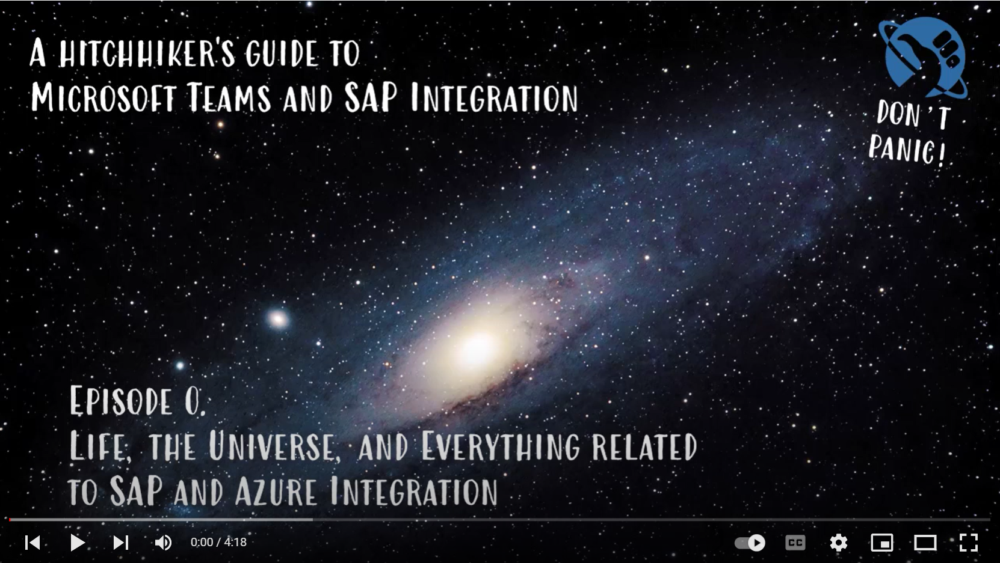

# 🌌 A hitchhiker's guide to Microsoft Teams and SAP Integration 🪐

## 🔭 Introduction

Many companies are interested to interact with their SAP systems and processes from that one single eco-system they spent the majority of their working day in. For many of us, it starts in the morning with a quick glance across your Outlook mailbox, trending Teams channels and chat messages, that arrived while you were off. To address that in one place eases friction, helps to focus your train of thought and ultimately boosts productivity. Also it encourages developers and software companies to tailor the interaction experience to fit collaboration tools cross platforms and prepare for chatbot experiences.

## 🎓 Learning Objectives

You will learn how to bring the best of both worlds - "Microsoft & SAP" - together in Teams and set yourself up for extensibility of the approach to create your own integration practice.

## 👩🏽‍💻 Lectures

- 101 [Setup Trust and SingleSignOn between Azure AD and your SAP IdP](Towel-Bearer/101-trust-sso.md)

- 102 [Embed your first SAP web application in Microsoft Teams](Towel-Bearer/102-embed-app.md)

- 103a [Configure SAP Principal Propagation with AAD and SAP OAuth server](Towel-Bearer/103a-sap-principal-propagation-basics.md)

- 103b [Streamline SAP Principal Propagation with API Management](Towel-Bearer/103b-sap-principal-propagation-apim.md)

- 42 [Build upon the solution for everything - Deploy your first Chatbot to Teams and query/change data in SAP](Towel-Bearer/42-chatbot-deploy.md)

So, grab your towels and let's jump on the next ship to Alpha Centauri.

## ✨ Recommended courses and further learning

- [Principal Propagation between Microsoft Power Platform and SAP - Hands-On Lab Instructions](https://github.com/raepple/sso-workshop)
- [What the Hack - challenge based hackathons for Microsoft workloads including SAP](https://github.com/microsoft/WhatTheHack/tree/master/052-SAPAppModernization)

## 🚸 Contributors

- [Robert Boban](https://www.linkedin.com/in/rboban/)
- [Martin Raepple](https://www.linkedin.com/in/martinraepple/)
- [Holger Bruchelt](https://www.linkedin.com/in/holger-bruchelt/)
- [Will Eastbury](https://www.linkedin.com/in/willeastbury/)
