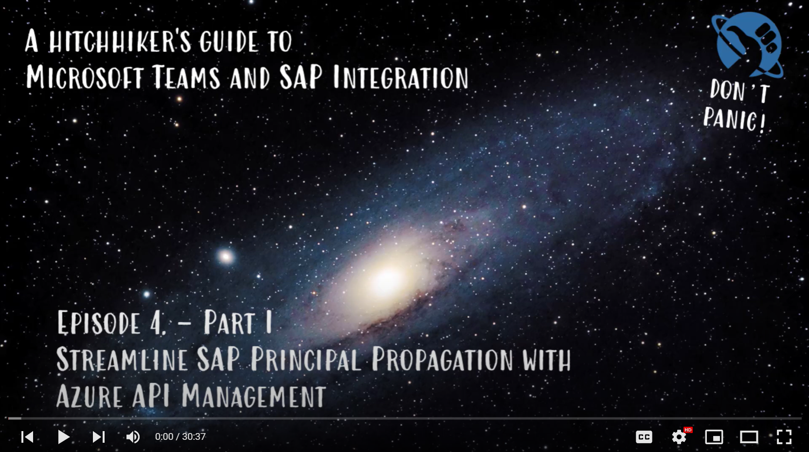
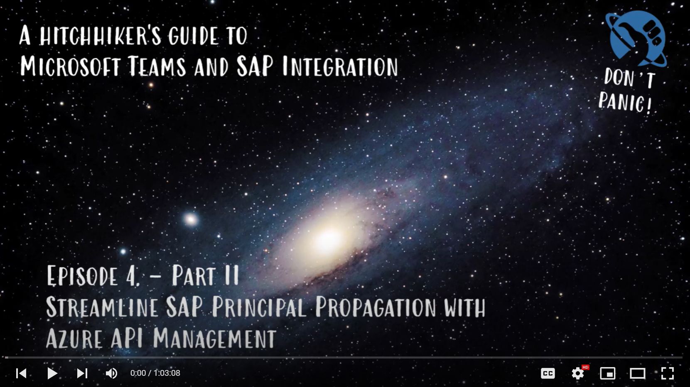

# Lecture 103b: Streamline SAP Principal Propagation with API Management

[< Previous Challenge](./103a-sap-principal-propagation-basics.md) - **[🏠Home](../README.md)** - [Next Challenge >](./42-chatbot-deploy.md)

## 🔭 Introduction

So far so good. You have established the famous "SAP Principal Propagation". It doesn't stop there though. Often there is a desire to deal with the complexity of this authentication mechanism in one place and solve for all clients centrally. We will be employing Azure APIM for that purpose.

*Didn't wear our towels during last session, but they were close. Got lucky this time.*

Part 1

Part 2

## 📖 Description

Familiarize yourself with this blog post "[AzureSAPODataReader](https://github.com/MartinPankraz/AzureSAPODataReader)" and [GitHub repos](https://blogs.sap.com/2021/08/12/.net-speaks-odata-too-how-to-implement-azure-app-service-with-sap-odata-gateway/) to learn more about the context.

- Ensure access to your APIM exposed API endpoints. Are you running externally only? Hybrid? Internet facing?
- [Convert](https://aka.ms/ODataOpenAPI) your OData $metadata to OpenAPIv3 and import into Azure APIM
- Clone git repos [AzureSAPODataReader](https://github.com/MartinPankraz/AzureSAPODataReader), configure your params on the bash script [UpdateAPIMwithVariablesForSAPPolicy.sh](https://github.com/MartinPankraz/AzureSAPODataReader/blob/master/Templates/UpdateAPIMwithVariablesForSAPPolicy.sh) and execute. The script pre-populates your APIM instance with the required "Named Values" for the following policy. The approach mimics the call sequence we verified via Postman before.
- Add [SAP Principal Propagation policy](https://github.com/Azure/api-management-policy-snippets/blob/master/examples/Request%20OAuth2%20access%20token%20from%20SAP%20using%20AAD%20JWT%20token.xml) to your OData api
- Build upon this [Postman collection](https://github.com/MartinPankraz/SAP-MSTeams-Hero/blob/main/Templates/Hitchhiker-103b.postman_collection.json) to test your setup (direct copy link [here](https://raw.githubusercontent.com/MartinPankraz/SAP-MSTeams-Hero/main/Templates/Hitchhiker-103b.postman_collection.json)).

### 🩺 Hints on troubleshooting

- [Use Policy Debugger in Visual Studio Code](https://docs.microsoft.com/azure/api-management/api-management-debug-policies)
- Use SAP transaction/web dynpro `/nsec_diag_tool` and add correct SAP client number 😏

## 🏆 Success Criteria

- Be able to call your SAP OData api through APIM using an Azure AD authenticated client
- Offloaded SAP Principal Propagation into APIM

## 📖 Further Reading

[Microsoft Docs for SAP OData import into APIM](https://docs.microsoft.com/azure/api-management/sap-api)

[Generate SDKs for any programming language using AutoREST and OpenAPI](https://github.com/Azure/autorest)

[Blog post on OData to OpenAPI converter](https://blogs.sap.com/2022/03/17/open-your-sap-odata-apis-for-some-swagger-or-how-to-make-friends-with-the-other-kids-from-the-api-block/)
